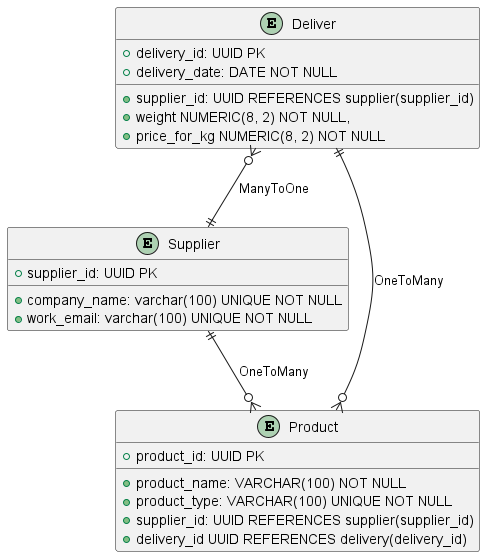
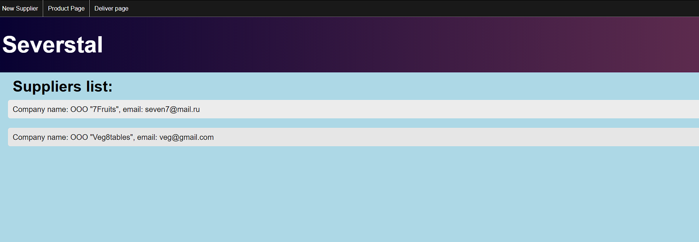
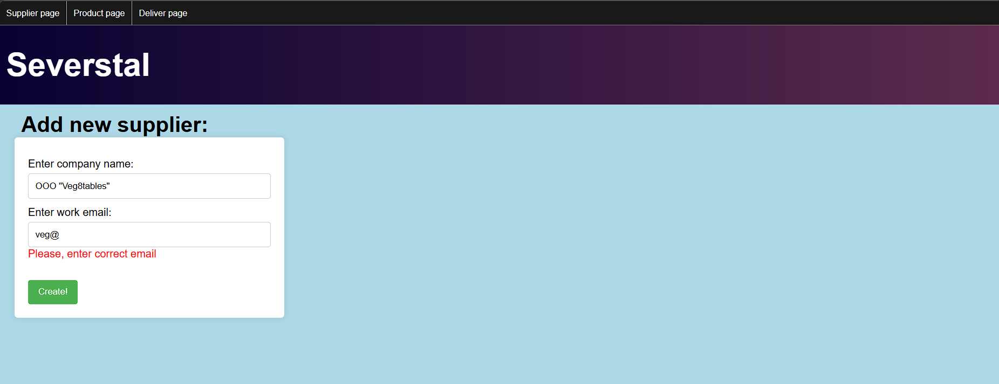
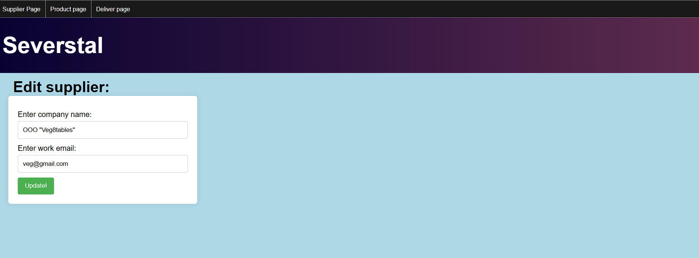
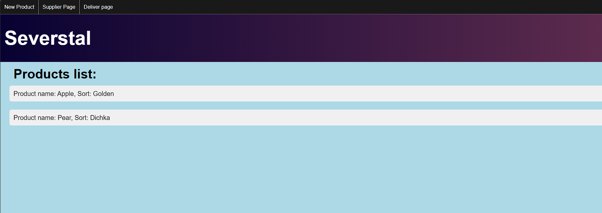
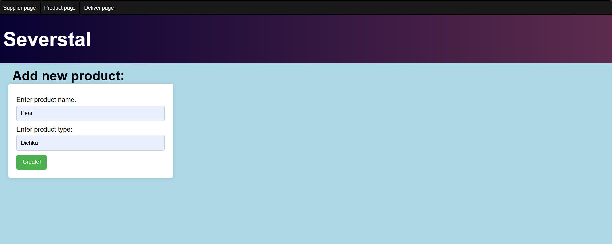
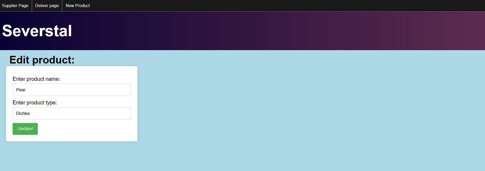
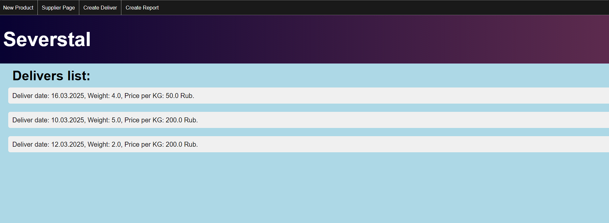
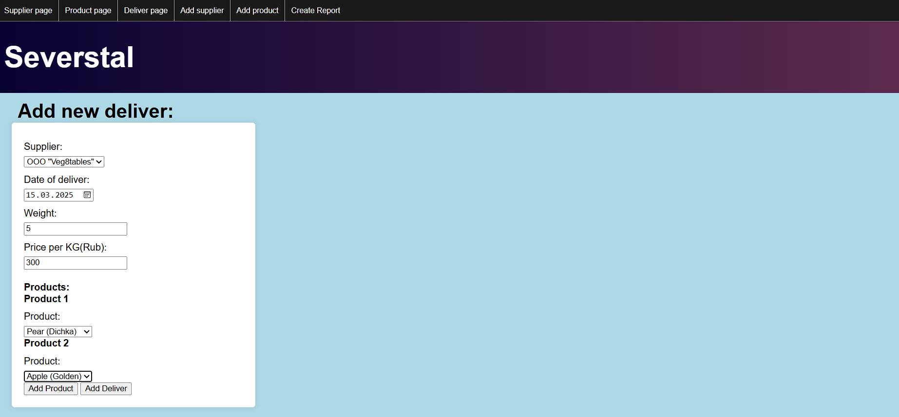
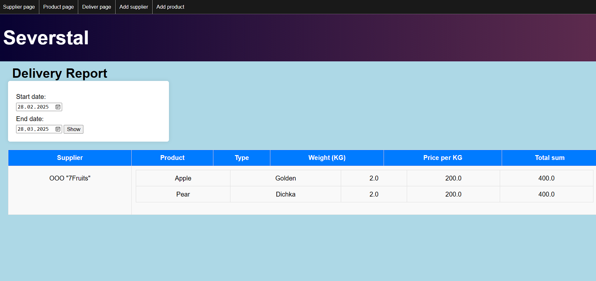

# Тестовое задание "Северсталь"

***Кейс:*** имеется 3 поставщика, каждый из поставщиков может поставлять 2 вида груш
и 2 вида яблок. Поставщики заранее сообщают свои цены на виды продукции на
определенный период поставок.  

***Задача***:
1. Создать интерфейс приёмки поставок от поставщиков. В одной поставке от
   поставщика может быть несколько видов продукции.
2. Создать отчёт. За выбранный период показать поступление видов продукции по
   поставщикам с итогами по весу и стоимости.

***Требования***:
1. Данные приложения должны сохранятся в БД путем формирования таблиц из
   объектов Backend (СУБД любая).
2. Backend – Hibernate, Java, Spring Framework.
3. Frontend – любая реализация.

---

### Решение:

- В начале работы над заданием я определил ключевые задачи, продумал логику,
разделил процесс разработки на этапы и спроектировал ER-диаграмму:

  

- Сначала я погрузился в разработку backend-части приложения, создав слои репозиториев, 
сервисов и контроллеров. Я интегрировал базу данных и применил инструмент миграции FlyWay. 
Особое внимание уделил валидации данных, чтобы избежать некорректных названий и числовых значений.

- После успешного завершения backend-разработки я приступил к созданию пользовательского интерфейса. 
Важно отметить, что для удобства пользователей веб-приложения они могут изменять личные данные поставщиков 
и продуктов в случае ошибок, а также просматривать всю информацию о поставщиках, продуктах и поставках.
В приложении присутствует удобная навигация между страницами, чтобы пользователь мог перемещаться только
на нужные представления.

- Страница со всеми поставщиками

  
- Добавление поставщика + валидация

  
- Обновление данных поставщика

  
- Страница со всеми продуктами

  
- Добавление продукта

  
- Обновление данных продукта

  
- Страница со всеми поставками

  
- Добавление поставки + несколько продуктов

  
- Составление отчета по поставках

  
- Далее я поработал над обработкой ошибок и логированием. Все действия в приложении 
логируются. В случае возникновения ошибки, она передается на уровень контроллера, 
где обрабатывается, а пользователь видит страницу с предложением повторить попытку.

- В завершении, для каждого класса слоя сервисов для проверки работоспособности
приложения мною были написаны тесты на Junit + Mockito.

---

### Использованные технологии:
1. Java
2. Spring
3. Spring Boot
4. Spring Validator
5. Spring Data 
6. Hibernate 
7. PostgreSQL 
8. Flyway 
9. HTML, CSS, Thymeleaf, JS 
10. Maven 
11. Lombok
12. Junit
13. Mockito
---
